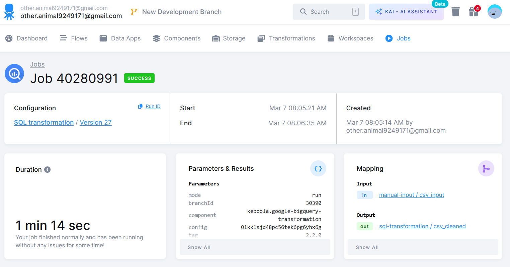
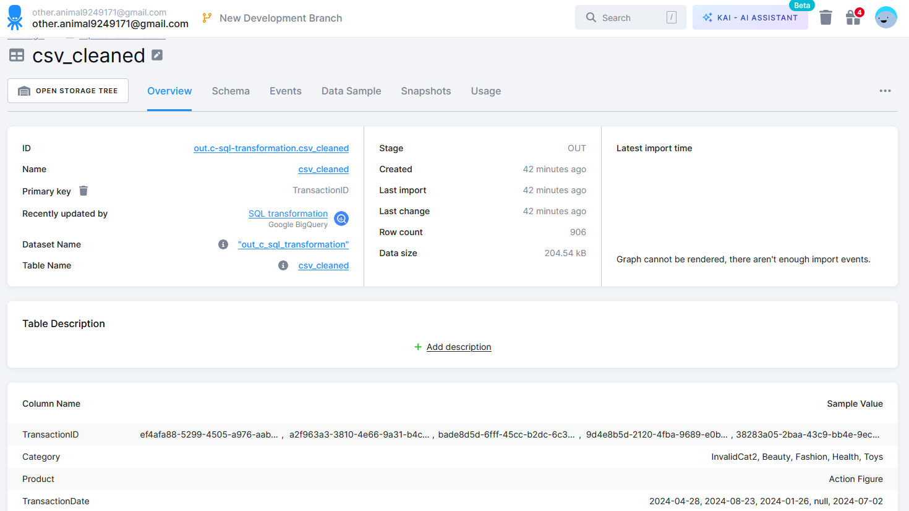

## Task 3 - Manual Input & SQL Transformation

Note: Keboola account was created a different from the email address used for the CV. Both evaluators have been added as read-only users to the project.

### Keboola Setup
* Created bucket: `in.c-manual-input`
* Uploaded source file as table: `csv_input`
* Created BigQuery SQL transformation: SQL transformation
* Output table: `out.c-sql-transformation.CSV_CLEANED`

### Data Quality Issues Found
* Duplicate rows: removed with SELECT DISTINCT
* NULL values in critical columns (TransactionID, CustomerID, Email): filtered out
* Malformed numeric values (e.g. date string in Quantity column): handled with SAFE_CAST
* Malformed date values in TransactionDate: handled with SAFE.PARSE_DATE
* Text fields standardized: TRIM and LOWER applied

### Bonus: Pushing to BigQuery
To automatically push CSV_CLEANED to BigQuery after transformation:
* Use Keboola's native BigQuery writer component (if doesn’t exist yet, it’s needed to create  Google Service Account & configure the connector)
* Add table to the connector
* Configure source: out_c_sql_transformation.CSV_CLEANED
* Configure destination: BigQuery dataset / table for the BI team
* Add BigQuery writer as a step in the Keboola orchestration pipeline after transformation
* Schedule orchestration to run (e.g. daily at 07:00 Prague time)

